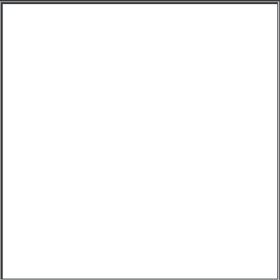
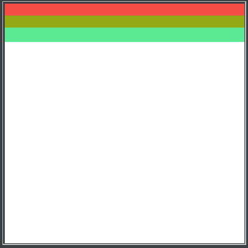

<h1>Q-Stack-Bitmap App</h1>
<br>
-By Shane Gable

This is a simple Java application that creates a visual representation of a Stack or Queue using a bitmap.

Try it out!

Commands: (In the form of --args)

1. delete: Clears all data. (Use this first because I probably pushed some random data)
2. read: This reads the data from the save.bmp and draws it out on result. It isn't very useful.
3. create [stack/queue]: creates either a stack or queue.
4. update stack: This followed by an appropriate method name will modify the current stack or queue.
  - push: Will push a new node with a random color value onto the bitmap stack.
  - pop: Will pop a node off of the bitmap stack.
5. update queue: This followed by an appropriate method name will modify the current stack or queue.
  - enqueue: Will push a new node with a random color value onto the bitmap queue.
  - dequeue: Will pop a value off the bitmap queue.
  
Walkthrough:

1. First, clear out any previous data by typing `./gradlew run --args='DELETE'`

This should give you a blank bitmap for result.bmp



2. Now you can create a stack or queue by typing `./gradlew run --args='CREATE STACK` 
or `./gradlew run --args='CREATE QUEUE'`

This will create an empty stack or queue. You shouldn't see any change to result.bmp

3. If you want to modify your new stack or queue you can type something like:
`./gradlew run --args='UPDATE STACK PUSH` or `./gradlew run --args='UPDATE QUEUE DEQUEUE'`

4. Have fun! Below is an example of running:
```
./gradlew run --args='CREATE STACK'
./gradlew run --args='UPDATE STACK PUSH'
./gradlew run --args='UPDATE STACK PUSH'
./gradlew run --args='UPDATE STACK PUSH'

```
